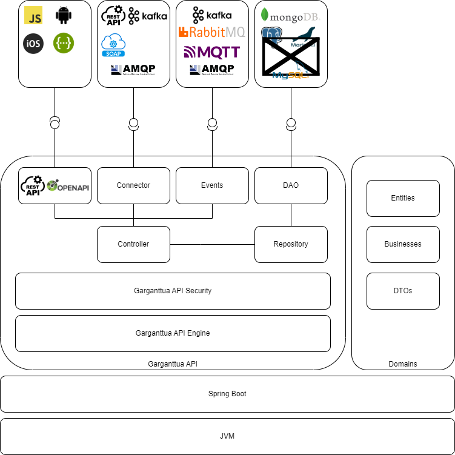

# Garganttua API

DISCLAIMER : This README is under construction, so it is not complete. 

Please check the example project available here : https://github.com/garganttua/garganttua-api-example

## Description

### Main features

This artifact is a library that, combined to the Spring Boot Framework, offers features to easily build an API which is domain oriented.
The main features offered by this artifact are :
 * Support for main databases system to store entities (For now, only mongoDB is supported)
 * Multitenancy
 * Built-in objects to enable an Http/Rest API that exposes CRUD endpoints to interact with entities
 * Support for security
   * Authentication based on multiple methods (For now, only Login/Password mechanism is supported)
   * Roles management
   * Endpoints access restriction based on roles 
   * Sessions (For now, only JWT token is supported)
    
### RoadMap

 * Record event when authentification
 * Add security to OpenAPI description
 * Improve unicity checking by allowing that entities and dtos may not have exactly same fields
 * add logging in WS
 * Implement state machine features
 * Implement SQL DAO for mysql, mariaDB, PostGre, Oracle, MSSQL
 * Implement Spring AOT
 * Implement Event publishers for kafka, mqtt, amqp
 * Improve the Rest Services returned object => find a way to parametrize the EntityResponse

### Architecture

#### Layers

Controller, WS, Repository, DAO, security 

### Note

This artifact is compiled with java 18 Compliance

## Usage

### Import the Garganttua API Framework Library 

First step is to create your Spring Boot Project. Then, you can import that artifact in your project.

To import into Maven project, add the following dependency inside `pom.xml`:

	<dependency>
		<groupId>com.garganttua</groupId>
		<artifactId>garganttua-api</artifactId>
		<version>1.0.0</version>
	</dependency>

For Gradle users, add these lines inside `build.gradle`:

    dependencies {
        compile group: 'com.garganttua', name: 'garganttua-api', version: '1.0.0'
    }
    
### Configuration

The next step is to create the configuration that indicates to the library, the configuration directives.
For that, copy/paste the content of application.properties provided with this library into your own .properties file. 

The basic configuration contained in the application.properties just enables Http/Rest API, nut not Security. 

### Instrument your existing code

As the basic configuration does not activate the security features, you should explicitly indicate to Spring that Security must not be loaded. 

To do so, just add the "exclude = SecurityAutoConfiguration.class" directive to your SpringBootApplication. 
You must also indicate to Spring Boot the Spring Domain Crudify packages to scan in order to let the Dynamic Domain Engine to start. 

Finally your main class should look like the following. 

	@ComponentScan({"com.mypackage", "com.garganttua"})
	@Configuration
	@SpringBootApplication(exclude = SecurityAutoConfiguration.class)
	public class Application {
	
		public static void main(String []args) {
			SpringApplication.run(Application.class, args);
		}
	
	}
	
### Develop your domains
Once the project is well set, it is now time to develop your domains. 

#### Use the Dynamic Domain Engine

This way to do is very convenient for building an API based on CRUD endpoints very quickly. But, by this way, CRUD endpoints and software layers cannot be overrided and the Swagger Web UI won't display the endpoints declared by the Garganttua API Engine. 

In that way to do, the only things you need to do is :
 * Chose the database (mongodb, ...)
 * Define your domain entities
 * Define your domain DTOs
 
Let's take a simple example : we imagine that we develop an API for booking meeting rooms. It is pretty simple to imagine that our API deals with 3 entities : 
1/ Meeting Room
2/ Booking
3/ Facilities

##### Entity Meeting Room 

	@Getter
	@Setter
	@NoArgsConstructor
	@AllArgsConstructor
	@Builder
	@GGAPIEntity(dto = "com.garganttua.api.example.MeetingRoomDTO", eventPublisher = "class:com.garganttua.api.example.CustomEventPublisher", domain = "meetingRooms")
	public class MeetingRoomEntity extends AbstractGGAPIEntity {

	@JsonProperty
	private String name;
	
	@JsonProperty
	private String location;
	
	@JsonProperty
	private String[] facilities;

	@Override
	public IGGAPIEntityFactory<MeetingRoomEntity> getFactory() {
		IGGAPIEntityFactory<MeetingRoomEntity> factory = new IGGAPIEntityFactory<MeetingRoomEntity>() {

			@Override
			public MeetingRoomEntity newInstance() {
				return new MeetingRoomEntity();
			}

			@Override
			public MeetingRoomEntity newInstance(String uuid) {
				MeetingRoomEntity entity = new MeetingRoomEntity();
				entity.setUuid(uuid);
				return entity;
			}
		};
		return factory ;
	}

}
	
##### DTO Meeting Room

	@Getter
	@Setter
	@NoArgsConstructor
	@AllArgsConstructor
	@Document(collection = "meetingRooms")
	public class MeetingRoomDTO extends AbstractGGAPIDTOObject<MeetingRoomEntity> {
	
	@JsonProperty
	private String name;
	
	@JsonProperty
	private String location;
	
	@JsonProperty
	private String[] facilities;
	
	public MeetingRoomDTO(String tenantId, MeetingRoomEntity entity) {
		super(tenantId, entity);
	}

	@Override
	public void create(MeetingRoomEntity entity) {
		this.name = entity.getName();
		this.location = entity.getLocation();
		this.facilities = entity.getFacilities();
	}

	@Override
	public MeetingRoomEntity convert() {
		MeetingRoomEntity mre = new MeetingRoomEntity(this.name, this.location, this.facilities);
		super.convert(mre);
		mre.setId(this.id);
		mre.setUuid(this.uuid);
		return mre;
	}

	@Override
	public void update(IGGAPIDTOObject<MeetingRoomEntity> object) {
		this.name = ((MeetingRoomDTO) object).getName();
		this.location = ((MeetingRoomDTO) object).getLocation();
		this.facilities = ((MeetingRoomDTO) object).getFacilities();
	}

	@Override
	public IGGAPIDTOFactory<MeetingRoomEntity, MeetingRoomDTO> getFactory() {
		IGGAPIDTOFactory<MeetingRoomEntity, MeetingRoomDTO> factory = new IGGAPIDTOFactory<MeetingRoomEntity, MeetingRoomDTO>() {
			@Override
			public MeetingRoomDTO newInstance(String tenantId, MeetingRoomEntity entity) {
				return new MeetingRoomDTO(tenantId, entity);
			}
		};
		return factory;
	}

}

### Activate the Swagger Web Ui

